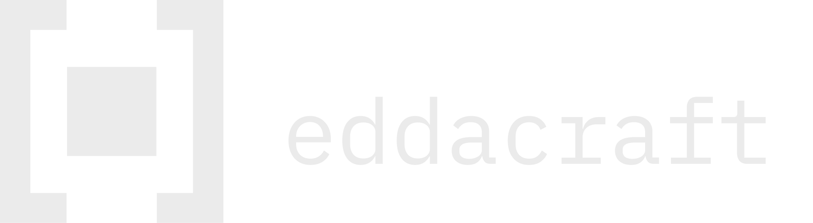

> **STATUS:** SYSTEM_ACTIVE  
> **MODE:** DETERMINISTIC  
> **SCOPE:** GOVERNANCE / MEMORY / INFRASTRUCTURE

### [ = ] THE_MISSION

**EddaCraft is the deterministic layer for non-deterministic work.**

We build infrastructure that forces AI-assisted development to behave like traditional engineering: **predictable, governed, and reversible.** We do not build "copilots"; we build the flight recorder and the autopilot limits.

| COMPONENT | TYPE | STATUS | FUNCTION |
| :--- | :--- | :--- | :--- |
| **`anvil`** | CLI Tool | `[BETA]` | Local-first governance & policy enforcement. |
| **`edda`** | Platform | `[DEV]` | Institutional memory & context graph. |
| **`kindling`** | Library | `[OPEN]` | Semantic primitives for agent context. |

### [ ≡ ] SYSTEM_CAPABILITIES

We govern the **output**, not the agent. Whether your team uses Cursor, Copilot, or Claude, our stack ensures the result meets your engineering standards before it enters the repo.

```
# THE EDDACRAFT STANDARD
governance:
  strategy: local-first
  privacy: strict (no code transit)
  policy: rego (OPA compatible)
  
philosophy:
  - "Authority precedes action."
  - "Memory before motion."
  - "Provenance over velocity."
```

### [ * ] OPEN_SOURCE_PROTOCOLS

We develop shared standards in the open to prevent vendor lock-in for AI governance.

#### 1. [`anvil-plan-spec`](https://github.com/EddaCraft/anvil-plan-spec)

**The Protocol for Intent.**
A declarative specification for planning, intent, and constraint in AI-assisted work. It allows you to define *what* the agent should do, and *what* it is forbidden from doing, in a format that survives the session.

#### 2. [`kindling`](https://github.com/EddaCraft/kindling)

**The Context Primitive.**
Small, composable memory structures for agentic workflows. "Don't just dump logs; structure the heat."

### [ > ] CONNECT

* **Docs:** [docs.eddacraft.ai](https://eddacraft.ai)
* **Waitlist:** `npm install -g @anvil/cli` (Coming Soon)
* **Contact:** `support@eddacraft.ai`

> *"If velocity obscures lineage, velocity loses."*
